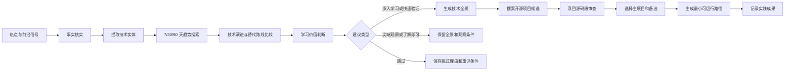
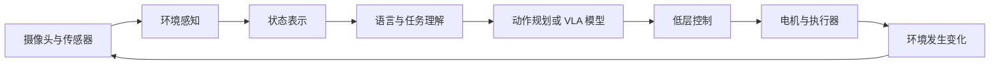

# AI 热点技术研判与项目化学习系统设计方案

> 目标项目：Grasp / AI 全景热点雷达  
> 上游能力：TrendRadar 与现有 AI Radar 事件系统  
> 文档用途：直接交给后续开发对话实施  
> 文档状态：需求与方案已确认  
> 制定日期：2026-08-15

## 1. 最终目标

在现有“热点发现、来源保存、事件合并、热度排序”能力上，增加一套“技术研判与项目化学习系统”。系统发现新技术后，不直接要求用户学习，而是先回答以下问题：

1. 这项技术解决什么问题？
2. 它处于整个技术体系的什么位置？
3. 最近是真的持续升温，还是一次性宣传？
4. 是否已有更成熟或更新的替代技术？
5. 学习后能迁移到哪些方向？
6. 当前时间、设备和算力是否足以实践？
7. 最终建议是深入学习、快速验证、尖端观察、了解即可，还是跳过？
8. 如果值得实践，哪个真实开源项目最适合作为主项目？
9. 应从主项目的哪条最小可运行路径开始？
10. 怎样证明用户已经掌握核心流程，而不是只看过资料？

例如：系统发现一个新的视觉语言动作模型后，不应直接生成课程，而应先比较它与行为克隆、传统视觉加控制、其他 VLA 模型的关系，再选择一个能在现有环境运行的开源项目。

## 2. 产品定位

产品正式定位为：

> **AI 热点驱动的技术研判与项目化学习系统。**

它不是普通新闻摘要器，也不是按照章节教学的课程平台。它把热点转化为四种结果：

- 行业认知：知道正在发生什么；
- 技术全景：知道技术由哪些模块组成，以及与其他路线的关系；
- 学习决策：知道是否值得投入时间；
- 项目成果：通过真实开源项目验证核心技术流程。

例如：公司高管变动可以产生行业认知，但通常不生成代码项目；新的知识蒸馏方法则可以产生技术全景、学习建议和模型压缩项目。

## 3. 必须修正的三个绝对规则

### 3.1 热点不等于必须学习

每条 AI 热点都有信息价值，但不一定有学习价值或项目价值。

例如：某个 AI 换脸娱乐事件可能传播很广，适合了解社会影响，但没有必要为它投入数天学习模型训练。

### 3.2 技术不强制对应一个新造项目

系统不凭空制造一个简化项目，而是搜索、审查并选择真实开源项目。随后在该项目中指定一条最小可运行路径。

例如：面对一个大型机器人仓库，系统不重新写一个玩具项目，而是指定“运行官方模拟示例—替换一个场景—修改一个动作任务—记录成功率”的实践范围。

### 3.3 一个技术最终选择一个主项目，但搜索阶段允许多个候选

一个技术可能有官方项目、低成本实现和模拟器实现。系统先比较候选，最终推荐一个主项目，同时保留最多两个有明确用途的备选。

例如：VLA 技术可以选择官方研究项目作为原始实现、模拟器项目作为低成本备选，但学习页面只突出一个当前最合适的主项目。

## 4. 三种价值必须分开

每个事件分别评估以下价值：

| 价值 | 含义 | 例子 |
|---|---|---|
| 信息价值 | 是否帮助理解行业正在发生什么 | 大模型公司调整价格 |
| 学习价值 | 核心能力能否迁移到其他方向 | 模型量化可迁移到端侧 AI 和机器人 |
| 实现价值 | 当前是否有合适项目、环境和可验证结果 | 普通电脑可运行一个小型量化模型 |

系统不得把三者混成一个分数。

例如：一种需要数百张 GPU 的训练方案可能信息价值和学习价值很高，但当前实现价值低，合理建议应是“尖端观察”，而不是“立即深入学习”。

## 5. 总体处理流程



例如：某框架突然爆火，但三个月没有代码更新，而且主流框架已经覆盖其能力，系统可以给出“了解即可”或“跳过”，同时保存未来重新评估的条件。

## 6. 学习建议分级

系统只能输出以下五种建议之一：

| 建议 | 适用情况 | 用户动作 |
|---|---|---|
| 深入学习 | 趋势持续、可迁移性强、项目成熟、条件允许 | 建立正式学习项目 |
| 快速验证 | 可能重要，但成熟度或持续性尚未确认 | 运行主项目核心流程 |
| 尖端观察 | 前沿价值高，但成本过高、代码不成熟或环境不具备 | 阅读全景并设置重评条件 |
| 了解即可 | 有行业信息价值，但学习收益有限 | 阅读摘要和技术位置 |
| 跳过 | 重复包装、明显衰退、已有更优替代或与目标无关 | 保留理由，不投入时间 |

每项建议必须包含原因，不能只显示颜色或数字。

例如：“建议快速验证：近 30 天增长明显，已有官方代码，但接口仍频繁变化；先运行示例，不建议投入长期系统学习。”

## 7. 研判维度与建议规则

### 7.1 研判维度

每项技术保存以下独立评分，范围为 0～100：

| 维度 | 解释 |
|---|---|
| 趋势强度 | 最近是否持续升温，而非单日爆发 |
| 技术新颖度 | 是否带来新的能力、性能或实现方式 |
| 技术成熟度 | 是否有稳定代码、文档、用户和复现证据 |
| 可迁移价值 | 学到的能力能否用于其他项目 |
| 项目可实践性 | 当前设备、时间和环境是否能运行 |
| 用户方向相关度 | 与具身智能、嵌入式等重点方向的关系 |
| 替代风险 | 是否已有更成熟或更新的技术替代 |
| 学习成本 | 时间、算力、硬件和环境搭建成本 |
| 证据可信度 | 是否有官方文档、论文、源码和独立验证 |

评分只是辅助，最终建议必须由文字理由解释。

例如：一个项目趋势强度 90，但成熟度 30、实践性 20，最终可能是“尖端观察”，而不是“深入学习”。

### 7.2 初始建议规则

- **深入学习**：趋势、迁移价值、证据和可实践性总体较高，且没有明显更优替代。
- **快速验证**：技术可能重要，但成熟度、趋势持续性或生态尚未确定。
- **尖端观察**：技术影响可能很大，但当前没有可运行项目、成本过高或仍处于研究阶段。
- **了解即可**：有行业意义，但技术学习收益低或与用户重点方向关系较弱。
- **跳过**：缺乏实质变化、重复营销、已经被替代，或者证据明显不足。

例如：只有一篇公司宣传稿、没有代码、没有论文、没有独立使用者的“全新智能体框架”，不能因为热度高就建议深入学习。

## 8. 趋势搜索与证据要求

### 8.1 时间窗口

每次研判至少比较：

- 最近 7 天：判断是否突然升温；
- 最近 30 天：判断是否形成持续讨论；
- 最近 90 天：判断是否有真实演进和生态积累。

对于成熟技术，可以额外比较 1 年变化。

例如：项目一天增加一万收藏，但过去 90 天没有代码提交，应标记“传播热度高，开发活跃度弱”。

### 8.2 证据来源

按以下优先级收集：

1. 官方产品或组织公告；
2. 原论文和作者项目页；
3. 官方或作者代码仓库；
4. 独立复现和评测；
5. 活跃开发者讨论；
6. 媒体报道；
7. 热榜和社交传播。

报告必须区分事实、作者主张、媒体转述和系统推测。

例如：官方声称性能提升 50%，但没有公开评测时，应写成“官方主张”，不能写成已被证实的事实。

### 8.3 必须检查替代技术

每次研判必须搜索：

- 同类主流方案；
- 上一代技术；
- 更新版本；
- 已知替代路线；
- 是否存在更容易实践的实现。

例如：发现一个旧的向量数据库教程时，应检查当前主流方案是否已经改变，以及原项目是否仍在维护。

## 9. 技术全景报告结构

每项有信息价值的技术都生成技术全景，但根据建议类型控制详细程度。

### 9.1 必填内容

1. 技术名称和一句话定义；
2. 它解决的问题；
3. 输入、处理和输出；
4. 完整处理流程图；
5. 核心模块与模块职责；
6. 每个模块的主流实现方式；
7. 上一代方案与当前变化；
8. 同类技术和替代方案；
9. 技术成熟度；
10. 当前限制；
11. 所需前置能力；
12. 可迁移能力；
13. 学习建议与理由；
14. 后续重评条件。

例如：具身智能技术全景不能只解释一个模型，而应包含传感器、环境感知、状态表示、任务理解、动作规划、低层控制、执行器、反馈、数据采集、训练和评估。

### 9.2 不同建议的详细程度

- 深入学习：完整全景、源码模块映射、主项目和实践路径。
- 快速验证：完整全景、主项目和核心流程验证。
- 尖端观察：完整全景、研究进展和重评条件，不强行实践。
- 了解即可：简化全景、行业位置和主要影响。
- 跳过：保留简短说明、跳过理由和替代技术。

例如：对成本极高的人形机器人基础模型，可以给出完整架构和项目来源，但不要求当前设备完成训练。

## 10. 开源项目搜索与选择

### 10.1 搜索数量

对“深入学习”和“快速验证”的技术，先搜索 5～10 个候选项目，再进行筛选。最终只向用户突出：

- 1 个主项目；
- 最多 2 个有明确用途的备选项目。

例如：主项目选择文档完整、能在当前环境运行的实现；备选项目分别承担“最接近论文”和“低成本运行”两种用途。

### 10.2 项目审查标准

不能只按照 GitHub 收藏数选择项目。必须检查：

| 项目条件 | 需要确认的内容 |
|---|---|
| 技术对应度 | 是否真正实现目标技术的核心流程 |
| 来源可信度 | 是否为官方、作者或有可靠维护者 |
| 活跃程度 | 最近提交、版本发布和问题处理情况 |
| 可运行性 | 安装说明、依赖、模型和数据是否完整 |
| 文档质量 | 是否有快速开始、架构说明和示例 |
| 环境适配 | Windows/Linux、CPU/GPU、内存和硬件要求 |
| 许可条件 | 是否允许学习、修改和二次使用 |
| 成本 | 下载、训练、推理和硬件成本 |
| 已知风险 | 安装失败、停更、承诺未实现或依赖过旧 |

例如：一个五万收藏但两年未更新的项目，可能不如一个三千收藏、示例完整且近期持续维护的项目适合学习。

### 10.3 固定项目版本

推荐结果必须保存：

- 仓库地址；
- 固定代码提交号或正式版本；
- 许可证；
- 最近维护时间；
- 环境要求；
- 审查日期；
- 已验证和未验证能力。

例如：不能只记录仓库首页，因为半年后主分支可能已经改变，原安装步骤可能无法复现。

## 11. 最小可运行路径

系统不生成一个新的最小项目，但必须从主开源项目中指定一条最小可运行路径。路径必须包含：

1. 准备环境；
2. 获取固定版本；
3. 下载必要模型或数据；
4. 运行官方最小示例；
5. 找出数据流和关键模块；
6. 修改一个输入、模块、参数或任务；
7. 记录运行结果；
8. 对照验收标准确认完成。

例如：学习目标检测不能停留在运行官方图片，应替换为自己的图片或摄像头，修改目标类别或阈值，并保存准确率或运行速度。

## 12. 项目成果与验收

主项目至少产生以下成果：

- 成功运行的代码或环境记录；
- 一张真实代码对应的技术流程图；
- 一次用户自己的修改；
- 运行截图、视频或输出文件；
- 一组重复测试结果；
- 失败记录和解决过程；
- 当前限制和下一步升级方向。

系统不得把“收藏了项目”“阅读了 README”标记为完成。

例如：机械臂项目应保存动作视频、测试次数和成功率，不能只上传机械臂照片。

## 13. 具身智能示例

当系统发现新的 VLA 或机器人操作技术时，应生成以下结构。

### 13.1 技术全景



### 13.2 必须比较的路线

- 固定视觉规则加控制；
- 目标检测加动作规划；
- 行为克隆；
- 模仿学习；
- 强化学习；
- 视觉语言动作模型；
- 世界模型与长期规划。

例如：如果目标只是桌面物体跟随，传统视觉加控制可能比大型 VLA 更合适；系统必须说明为什么不需要追逐最复杂方案。

### 13.3 主项目选择

系统搜索官方实现、模拟器实现和低成本硬件实现，选择一个当前环境可运行的主项目。

例如：当前没有机械臂时，可以选择流程完整的模拟器项目作为主项目，但必须说明它尚未验证真实电机、通信延迟和传感器噪声。

### 13.4 最小可运行路径

- 运行官方场景；
- 找到观察数据进入模型的位置；
- 找到动作输出位置；
- 替换一个物体或任务；
- 运行多次并记录成功率；
- 画出源码模块与感知—决策—控制流程的对应关系。

这条路径使用真实项目，不另外创造一个玩具 MVP。

## 14. 数据保存设计

现有热点记录可以只保留最近 7 天，但技术全景、研判报告、项目选择和学习成果必须长期保存。

建议新增以下数据表或等价存储结构。

### 14.1 `technologies`

保存技术实体：

- 技术名称；
- 标准名称和别名；
- 一句话定义；
- 所属领域；
- 生命周期；
- 首次和最近发现时间；
- 当前学习建议；
- 当前主项目。

例如：“视觉语言动作模型”“VLA”“Vision-Language-Action”应指向同一技术实体。

### 14.2 `technology_event_links`

保存热点事件与技术之间的关系。

例如：一个机器人产品发布事件可以同时关联 VLA、端侧推理和电机控制三项技术。

### 14.3 `technology_assessments`

保存每次研判：

- 研判日期；
- 7/30/90 天趋势证据；
- 各维度评分；
- 学习建议；
- 建议理由；
- 替代技术；
- 重评条件；
- 证据链接。

例如：同一技术三个月后可以从“尖端观察”变为“快速验证”，历史判断仍然可以追溯。

### 14.4 `technology_landscapes`

保存技术全景版本、流程图、模块、前置能力、限制和演进路线。

例如：新的主流架构出现后生成第二版全景，旧版不覆盖删除。

### 14.5 `project_candidates`

保存候选项目：

- 仓库地址；
- 固定版本；
- 来源身份；
- 项目审查结果；
- 环境和成本；
- 许可证；
- 适用角色；
- 已知风险；
- 是否为主项目或备选。

例如：一个项目可以标记为“最接近论文，但需要高端 GPU”，另一个标记为“低成本模拟器备选”。

### 14.6 `learning_projects`

保存用户实际采用的项目：

- 对应技术；
- 主项目和固定版本；
- 最小可运行路径；
- 当前进度；
- 验收标准；
- 代码或成果位置；
- 开始和完成时间。

例如：热点对话只读取 7 天，但三个月前已经完成的摄像头识别项目仍然保存在学习项目中。

### 14.7 `learning_evidence`

保存截图、视频、日志、测试结果、失败记录和用户修改说明。

例如：成功运行一次不能代替重复测试，系统应允许保存 10 次测试的成功率。

## 15. API 设计建议

建议在现有 AI Radar 接口上增加：

```text
GET  /api/ai-radar/technologies
GET  /api/ai-radar/technologies/{technology_id}
POST /api/ai-radar/events/{event_id}/extract-technologies
POST /api/ai-radar/technologies/{technology_id}/assess
GET  /api/ai-radar/technologies/{technology_id}/assessments
POST /api/ai-radar/technologies/{technology_id}/build-landscape
GET  /api/ai-radar/technologies/{technology_id}/landscape
POST /api/ai-radar/technologies/{technology_id}/search-projects
GET  /api/ai-radar/technologies/{technology_id}/projects
POST /api/ai-radar/technologies/{technology_id}/select-project
POST /api/ai-radar/technologies/{technology_id}/create-learning-project
GET  /api/learning-projects
GET  /api/learning-projects/{project_id}
PATCH /api/learning-projects/{project_id}
POST /api/learning-projects/{project_id}/evidence
POST /api/learning-projects/{project_id}/complete
```

例如：`POST /technologies/{id}/assess` 生成新的趋势研判版本，但不能覆盖删除之前的判断。

## 16. 页面设计

### 16.1 热点列表

在现有事件卡片增加：

- 涉及技术；
- 学习建议标签；
- 是否已有技术全景；
- 是否已有主项目；
- “查看技术研判”入口。

例如：“Google 发布手语转文本模型”可以显示“快速验证”，用户点击后进入相关技术而不是只看新闻正文。

### 16.2 事件详情

保留现有事件证据、原始标题、排名、正文和链接，并增加“关联技术”区域。

例如：一个 Robot Phone 事件可以关联端侧模型、计算机视觉、云台控制、嵌入式功耗和智能体交互。

### 16.3 技术详情

建议使用以下标签页：

1. **研判结论**：是否值得学、趋势证据和原因；
2. **技术全景**：流程、模块、演进、替代路线和限制；
3. **项目对标**：主项目、备选和审查证据；
4. **实践路径**：主项目最小可运行范围和验收标准；
5. **学习记录**：代码、成果、测试和问题；
6. **历史变化**：以前的建议和重评记录。

例如：用户可以看到一项技术三个月前是“尖端观察”，现在因为官方代码和低成本模型发布而变成“快速验证”。

### 16.4 关键操作

- 重新研判；
- 更新技术全景；
- 搜索项目；
- 选择主项目；
- 加入学习；
- 标记观察；
- 标记跳过；
- 提交成果；
- 完成验收。

例如：点击“标记跳过”时必须记录原因和未来重新评估条件，不能永久隐藏技术。

## 17. 自动生成策略与服务器负载

为了避免对服务器和模型接口造成过大压力，不对所有热点自动执行完整项目审查。

### 17.1 每条 AI 热点自动执行

- 事件分类；
- 技术实体提取；
- 基础信息价值判断；
- 与已有技术实体关联。

例如：普通公司人事新闻可以止步于基础判断，不继续搜索十个 GitHub 项目。

### 17.2 满足条件后自动执行

对技术重要性较高、快速升温或用户主动打开的技术执行：

- 7/30/90 天趋势搜索；
- 学习价值研判；
- 技术全景生成。

例如：三个平台同时出现的新模型技术可以自动进入研判队列。

### 17.3 用户确认或建议为学习后执行

- 深度搜索项目；
- 项目源码级审查；
- 选择主项目；
- 生成最小可运行路径。

例如：建议为“了解即可”的新闻不自动消耗资源搜索大量项目。

### 17.4 任务调度限制

- 深度研判队列并发数默认为 1；
- 项目搜索与浏览器全文抓取错开执行；
- 在线模型调用失败时进入重试队列，不阻塞原始热点采集；
- 每项任务记录开始、结束、耗时和失败原因；
- 设置每日最大分析数量和模型费用上限。

例如：凌晨已有 Grasp 浏览器采集任务时，技术项目审查应排队等待，不能同时启动多个浏览器进程。

## 18. 报告模板

每项技术的最终报告按以下顺序展示。

### 18.1 决策摘要

- 建议：深入学习 / 快速验证 / 尖端观察 / 了解即可 / 跳过；
- 一句话理由；
- 适合现在学习还是以后重评；
- 最大收益；
- 最大成本或风险。

例如：“建议快速验证：端侧视觉模型正在持续增长，能力可迁移到智能硬件和机器人；但当前模型生态仍在快速变化。”

### 18.2 趋势证据

- 7/30/90 天变化；
- 热榜与开发生态；
- 官方发布、论文和项目；
- 独立复现；
- 证据不足之处。

例如：不能只用 GitHub 收藏增长证明技术成熟，还要检查发布版本和实际使用。

### 18.3 技术全景

- 问题、输入、输出；
- 流程图；
- 核心模块；
- 技术演进；
- 主流方案；
- 替代技术；
- 限制。

例如：解释知识蒸馏时，要说明教师模型、学生模型、训练目标、数据和评测如何连接。

### 18.4 学习价值

- 能获得什么能力；
- 能迁移到什么领域；
- 需要哪些前置能力；
- 当前学习成本；
- 为什么现在学或为什么暂不学。

例如：模型量化学习成果可以迁移到手机、嵌入式设备和机器人端侧部署。

### 18.5 对标项目

- 主项目和选择理由；
- 固定版本；
- 技术模块与源码目录对应关系；
- 环境、设备和成本；
- 两个以内的备选；
- 已验证与尚未验证内容。

例如：项目 README 声称支持 Windows，但尚未实际运行时必须标记“尚未验证”，不能写成确定支持。

### 18.6 实践与验收

- 最小可运行路径；
- 用户需要修改的内容；
- 预期输出；
- 重复测试；
- 完成证据；
- 下一阶段升级方向。

例如：运行官方示例后，必须替换自己的输入或任务，才能标记为完成核心验证。

## 19. 验收标准

### 19.1 功能验收

1. 一个热点可以关联一个或多个技术实体。
2. 同一技术的不同名称可以合并。
3. 技术可以生成 7/30/90 天趋势研判。
4. 每次研判都有建议、理由和证据链接。
5. 研判会检查更新技术和替代路线。
6. 技术全景包含流程、模块和技术演进。
7. “深入学习”和“快速验证”技术可以搜索项目候选。
8. 系统能选择一个主项目，并说明为什么没有选择其他项目。
9. 主项目保存固定版本、许可、环境和已知风险。
10. 系统提供真实项目中的最小可运行路径。
11. 用户可以保存成果、测试和失败记录。
12. 热点数据过期后，技术与学习成果仍然存在。

例如：删除七天前的热点记录后，已经建立的 VLA 技术全景和用户实践项目不能消失。

### 19.2 质量验收

1. 不把热度直接等同于学习价值。
2. 不把公司宣传当成独立验证。
3. 不为无技术项目价值的新闻强行生成代码项目。
4. 不只按 GitHub 收藏数选择项目。
5. 不推荐已经停更且有明确替代方案的项目而不作说明。
6. 不把无法运行的项目写成已经验证。
7. 不把阅读资料或收藏仓库标记为完成。
8. 所有重要结论都能追溯到原始来源。

例如：一个仓库安装失败时，应记录具体失败环节并切换备选项目，不能继续把它标记为“推荐且可运行”。

### 19.3 资源验收

1. 深度任务并发默认为 1。
2. AI 分析失败不影响热点采集。
3. 浏览器抓取与现有重任务错峰。
4. 每项任务记录资源与耗时。
5. 达到每日费用或任务数量上限后停止新增深度任务。

例如：项目搜索任务占用过高时可以延后，但热点标题、排名和链接仍须正常保存。

## 20. 推荐实施顺序

### 第一阶段：技术实体与研判报告

- 从热点中提取技术；
- 建立技术实体和别名合并；
- 实现 7/30/90 天趋势搜索；
- 实现五级学习建议；
- 在事件页增加技术入口。

例如：先确保同一个 VLA 技术不会因为中英文名称不同而生成多个重复页面。

### 第二阶段：技术全景

- 生成问题、输入、输出和流程；
- 拆解模块；
- 建立演进与替代路线；
- 保存版本和证据。

例如：技术全景更新后保留旧版本，用户可以看到技术路线怎样变化。

### 第三阶段：项目搜索与审查

- 搜索候选项目；
- 固定版本；
- 检查源码、文档、许可和环境；
- 选择主项目和备选；
- 生成最小可运行路径。

例如：先支持 GitHub 项目，再逐步增加 Hugging Face 模型和论文代码。

### 第四阶段：学习成果闭环

- 创建学习项目；
- 记录进度和成果；
- 上传截图、视频和日志；
- 执行验收；
- 把完成能力加入长期能力档案。

例如：完成目标检测项目后，后续机器人项目应复用该能力，不再从头推荐同样的基础任务。

## 21. 第一版明确不做

- 不自动替用户决定必须学习；
- 不为每条热点强行生成项目；
- 不凭空重写一个与真实生态脱节的 MVP；
- 不自动下载并运行所有候选仓库；
- 不自动购买硬件或付费服务；
- 不把模型评分当成唯一结论；
- 不删除旧研判和旧技术全景；
- 不让项目分析失败影响热点采集。

例如：系统可以推荐一个机械臂项目和设备清单，但不能因为项目需要硬件就自动下单。

## 22. 给实现对话的任务摘要

在现有 AI Radar 上增加“技术研判与项目化学习”能力。保留现有热点、来源、排名和正文功能。热点事件先提取并关联技术实体，再搜索最近 7、30、90 天的趋势、论文、官方发布、开发生态和替代路线，分别判断信息价值、学习价值和实现价值，并输出“深入学习、快速验证、尖端观察、了解即可、跳过”五级建议。每项建议必须包含证据、理由和重评条件。

对值得学习或快速验证的技术生成完整技术全景，包括问题、输入输出、流程、模块、技术演进、主流方案、替代路线、限制和前置能力。随后搜索 5～10 个真实开源项目，进行源码、文档、活跃度、许可、环境、成本和可运行性审查，最终选择一个主项目和最多两个明确用途的备选项目。不要另外创造玩具 MVP，但必须在主项目中确定一条最小可运行路径，并要求用户运行、修改、测试和保存成果。

热点记录可以只保留最近 7 天，但技术实体、研判报告、技术全景、项目选择和用户成果必须长期保存。深度任务串行执行，不能影响现有热点采集和 Grasp 服务。

例如：一项 VLA 热点最终应显示是否值得学习、趋势证据、完整感知—决策—控制框架、同类和替代技术、当前主项目、固定版本、运行条件、最小可运行路径和验收结果。
