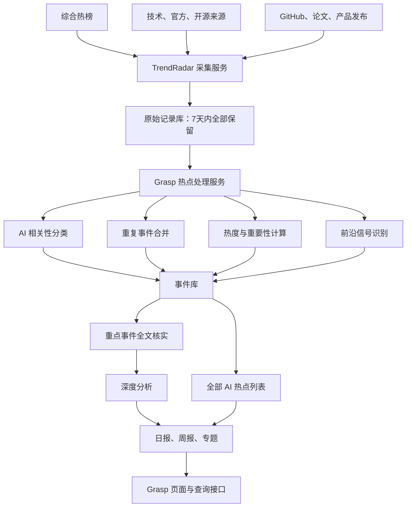

# AI 全景热点与前沿信号雷达设计方案

> 目标项目：Grasp 服务器  
> 采集底座：TrendRadar 6.10.0（第一阶段固定版本）  
> 文档状态：需求与技术方案已确认  
> 制定日期：2026-08-15

## 1. 建设目标

建设一个覆盖全行业的 AI 情报系统，持续完成以下工作：

1. 采集综合热榜中的 AI 相关内容。
2. 保存所有 AI 热点及其排名变化。
3. 发现尚未进入大众热榜、但技术或行业上可能重要的前沿信号。
4. 对重要事件进行全文核实和深度解析。

系统负责“发现、整理和解释”，不替用户判断创业价值、市场需求或投资价值。

例如：一款 AI 玩具登上抖音热榜后，无论它是否有明确商业价值，都必须保存；系统可以解释它为什么火，但不能因为“需求不明确”而过滤。

## 2. 核心设计原则

### 2.1 先保存，再判断

所有采集到的原始记录必须先保存，之后再进行 AI 分类。即使 AI 判断为“不相关”，在 7 天有效期内也不能提前删除，防止模型误判；第 8 天按统一规则删除。

例如：“荣耀新形态终端”标题没有直接出现 AI，但正文可能介绍 Robot Phone，因此必须保留原始记录，允许后续重新识别。

### 2.2 AI 只负责整理，不负责删除事实

AI 可以执行：

- 判断是否与 AI 相关；
- 添加行业标签；
- 合并相同事件；
- 判断是否需要深度处理；
- 生成解释和摘要。

AI 不可以直接删除原始热点。

例如：AI 把一条芯片新闻误判为普通硬件新闻时，原始标题、平台、排名和链接仍然存在。

### 2.3 热度和行业重要性分开计算

每个事件至少有两个独立分数：

- 热度分：反映多少人在关注。
- 重要性分：反映是否可能改变技术或行业。

例如：AI 表情包可能热度 90、重要性 30；一种新型推理芯片可能热度 40、重要性 90。

### 2.4 不凑栏目、不凑数量

没有新政策时，不显示政策板块；只有三条重要事件时，只深度处理三条。

例如：当天没有国家 AI 文件，日报直接省略政策部分，而不是重复昨天的政策。

### 2.5 所有判断必须返回原始证据

深度分析必须附原文链接，并明确区分：

- 官方已经确认；
- 媒体报道；
- AI 根据多个信号推测；
- 尚未确认。

例如：媒体声称某公司将发布机器人，但公司官网没有消息，应显示“媒体报道，尚未找到官方确认”。

## 3. 总体技术架构



### 3.1 组件分工

| 组件 | 主要职责 | 用户看到的结果 |
|---|---|---|
| TrendRadar | 采集热榜、网站订阅和排名 | 持续获得原始热点 |
| 原始记录库 | 保存所有采集记录 | 误判后仍可找回 |
| Grasp 处理服务 | 分类、合并、排序 | 相同事件不会重复刷屏 |
| 全文核实服务 | 阅读重要事件原文 | 深度报告有证据 |
| 报告服务 | 生成完整列表和深度内容 | 既能快速看重点，也能查看全部 |

例如：同一款模型在微博、知乎和 B 站分别出现，TrendRadar 保存三条原始记录，Grasp 将其合并为一个事件，但用户仍能展开查看三个平台的原始标题。

## 4. TrendRadar 部署方式

采用独立 Docker 容器，不修改 TrendRadar 核心代码，第一阶段固定使用已经验证过的 6.10.0 版本。

建议服务目录：

```text
grasp-server
├─ trendradar
│  ├─ config
│  ├─ output
│  └─ sqlite-data
├─ ai-radar
│  ├─ analysis
│  ├─ reports
│  └─ logs
└─ backups
```

具体要求：

- TrendRadar 每 30 分钟采集一次。
- 数据目录必须挂载到服务器磁盘，重启容器后不能消失。
- 不使用自动变化的 `latest` 镜像标签。
- TrendRadar 与 Grasp 通过服务器内部网络通信。
- TrendRadar 的查询接口不能直接暴露到公网。
- AI 密钥、推送密钥不能写入代码仓库。

例如：服务器重启后，前一天保存的微博排名和首次发现时间必须仍然存在，不能重新变成一条“刚发现”的新闻。

### 4.1 已确认的服务器运行保护

TrendRadar 保留采集、内置 AI 分析和网页报告，不通过关闭功能换取低内存。后台容器长期运行，但每 30 分钟只执行一轮任务，其余时间等待。

- 执行前检查服务器当前可用内存，低于 800MB 时跳过本轮，等待下一次；
- 容器内存最高 500MB，超过后只终止本轮 TrendRadar；
- 容器最多使用 1 个处理器核心；
- 上一轮未结束时不启动下一轮；
- 不启动 Chromium、Playwright 等浏览器；
- 重点新闻正文由 Grasp 使用普通网页请求读取；
- TrendRadar 固定使用 6.10.0，不使用会自动变化的 `latest`；
- 原始标题、正文、分析结果、运行记录和报告只保留 7 天，第 8 天删除；
- TrendRadar 每小时 00 分和 30 分采集，Grasp 在 05 分和 35 分导入、读取正文和整理事件。

例如：服务器在 10:30 只剩 650MB 可用内存，本轮显示“因内存不足已跳过”；11:00 如果恢复到 1.1GB，就重新正常执行，不补开多个重叠任务。

## 5. 信息源设计

### 5.1 综合热榜

第一阶段接入：

- 微博；
- 抖音；
- 知乎；
- 哔哩哔哩；
- 百度；
- 今日头条；
- 贴吧；
- 财经媒体热榜；
- 其他 TrendRadar 已支持的平台。

综合热榜主要反映大众热度。

例如：“AI 复活逝者”进入微博热搜，即使没有技术突破，也属于重要的 AI 社会热点。

### 5.2 技术与产品来源

建议增加：

- GitHub Trending、版本发布和收藏增长；
- Hugging Face 模型与数据集；
- arXiv、OpenReview；
- 国内外 AI 公司官方博客；
- 云服务和芯片厂商更新；
- 机器人公司和智能硬件公司；
- 主流技术媒体；
- 重要开发工具发布日志。

这些来源主要负责发现前沿信号。

例如：某个 AI 编程项目尚未上微博热搜，但一周内 GitHub 收藏从 2,000 增加到 20,000，应进入前沿信号。

### 5.3 官方和政策来源

建议接入：

- 国务院；
- 国家发展改革委；
- 科技部；
- 工业和信息化部；
- 国家数据局；
- 国家网信办；
- 国家自然科学基金委员会；
- 国资委；
- 重点省市政府；
- 行业标准组织。

官方来源按事件触发，不设置每日数量。

例如：工信部发布 AI 产业试点名单时显示政策板块；没有新文件时不显示政策栏目。

### 5.4 后续扩展来源

第二阶段可以增加：

- 产品众筹平台；
- 应用商店榜单；
- 招聘岗位变化；
- 专利和论文引用变化；
- 融资与并购信息；
- 视频平台评论趋势。

这些内容用于提供背景，不作为热点是否保存的门槛。

例如：大量公司突然招聘“VLA 算法工程师”，可以作为具身智能升温的辅助证据。

## 6. 全行业 AI 覆盖范围

系统至少覆盖以下方向：

1. 基础模型、多模态模型、世界模型和推理模型；
2. AI 智能体、浏览器智能体和电脑操作智能体；
3. AI 编程、开发工具和开源项目；
4. 芯片、算力、云服务、数据中心和推理优化；
5. 人形机器人、桌面机器人、灵巧手和具身智能；
6. AI 手机、眼镜、玩具和可穿戴设备；
7. 自动驾驶、无人机、Robotaxi 和无人配送；
8. 图片、视频、声音、音乐、数字人和游戏生成；
9. 医疗、教育、金融、制造、科研、农业、法律和办公应用；
10. 公司融资、收购、合作、竞争和重要人员变化；
11. 监管、版权、安全、就业、欺诈和伦理问题；
12. 其他暂时无法准确分类的 AI 相关热点。

具身智能是用户重点方向，可以获得更细的技术拆解，但不能挤掉其他 AI 行业热点。

例如：同一天出现“机器人灵巧手突破”“新一代编程模型”和“GPU 出口政策变化”，三类都必须进入系统。

## 7. AI 相关性判断

系统将内容分成三类：

- **明确相关**：确定属于 AI；
- **可能相关**：标题含糊，需要读取正文；
- **不相关**：确认与 AI 无关。

处理规则：

- 明确相关：进入 AI 热点库；
- 可能相关：保留并进入二次检查；
- 不相关：保留原始记录，但不进入默认 AI 报告；
- 用户或系统可以重新分类。

分类时不能只依赖关键词，还要识别标题语义。

例如：“智能座舱升级”可能涉及端侧模型，也可能只是更换显示屏，需要读取摘要或正文确认。

建议分类结果：

```json
{
  "classification": "可能相关",
  "confidence": 0.62,
  "categories": ["智能汽车", "端侧AI"],
  "reason": "标题提到智能座舱，但没有明确说明是否使用AI模型"
}
```

这里的可信度只是模型对自身分类判断的把握，不代表新闻真实性。例如 `0.62` 表示模型不十分确定，应继续核实。

## 8. 事件合并规则

系统不能把每个标题都当成独立事件，需要建立“事件”与“原始记录”的对应关系。

### 8.1 精确合并

满足以下条件可直接合并：

- 链接完全相同；
- 标题标准化后相同；
- 来源转载同一篇文章。

例如：标题末尾只多了“最新消息”的两篇转载，可以合并。

### 8.2 语义合并

结合以下信息判断是否为同一事件：

- 公司或人物；
- 产品或项目名称；
- 发布动作；
- 时间；
- 原始公告；
- 标题语义。

例如：“OpenAI 发布新模型”和“GPT-X 正式上线”可能属于同一事件，需要结合正文和发布时间判断。

### 8.3 合并限制

- 在 7 天有效期内，原始记录不因合并或 AI 判断而删除；第 8 天统一清理；
- 合并结果必须可以手动拆开；
- 不能确定时宁可暂不合并；
- 一个事件可以对应多个平台和多个来源。

例如：“某公司发布机器人”和“该机器人获得融资”涉及同一产品，但属于不同动作，不应强行合并为同一事件。

## 9. 热度计算

热度分范围为 0～100，建议初始权重如下：

| 信号 | 初始权重 |
|---|---:|
| 当前及历史最高排名 | 30% |
| 跨平台数量 | 25% |
| 排名上升速度 | 20% |
| 在榜持续时间 | 15% |
| GitHub、视频或产品等额外增长 | 10% |

不同平台的排名需要先转换成可比较的比例。例如微博第 5 名和只有 20 条内容的垂直榜第 5 名，不能直接视为相同热度。

建议额外保存：

- 首次发现时间；
- 最近发现时间；
- 当前排名；
- 历史最高排名；
- 平台数量；
- 排名变化；
- 热度变化方向。

例如：一个事件从单平台第 40 名上升到三个平台前 10，应显示“快速升温”，而不是只展示当前分数。

热度分只用于排序，不表示事实真伪、商业价值或真实市场需求。

## 10. 行业重要性计算

重要性分也采用 0～100，但不能直接沿用热度信号。

建议参考：

| 判断因素 | 例子 |
|---|---|
| 是否带来明显技术变化 | 推理成本下降、上下文长度增加 |
| 是否改变产品形态 | AI 手机出现可移动摄像头 |
| 是否影响大量开发者 | 主流模型接口停止兼容旧版本 |
| 是否影响产业竞争 | 芯片出口政策变化 |
| 是否形成新研究方向 | 世界模型、具身基础模型升温 |
| 是否来自可信原始来源 | 官方公告、论文、代码仓库 |
| 是否可能长期影响行业 | 新标准、重大收购、平台规则变化 |

重要性判断必须给出理由，不能只返回数字。

```json
{
  "importance_score": 86,
  "reason": [
    "发布了可公开下载的模型和代码",
    "显著降低机器人训练所需的数据量",
    "已有三个研究团队复现"
  ]
}
```

例如：如果只有公司宣传，没有代码、论文或第三方验证，应降低证据可信程度，而不是直接判定为技术突破。

## 11. 深度处理触发规则

满足任意一项即可进入深度处理候选：

- 热度分不低于 75；
- 重要性分不低于 80；
- 同时出现在至少 3 个平台；
- 排名短时间快速上升；
- 重要模型、产品、开源项目正式发布；
- 重要政策或监管发生变化；
- 用户重点方向出现明显变化；
- 同一主题连续多天升温。

深度处理数量不固定：

- 没有符合条件的事件时，不强行生成；
- 符合条件的事件都进入处理队列，但设置单次成本上限；
- 超过成本上限时，剩余事件等待下一批处理；
- 未深度处理的内容仍显示在完整热点列表中。

例如：当天有 8 条事件达到标准，就处理 8 条；如果有 50 条达到标准，可以先处理分数最高的 25 条，其余显示“等待深度处理”，不能隐藏。

## 12. 深度分析内容结构

每个重点事件生成以下内容：

1. 一句话说明发生了什么；
2. 事件时间线；
3. 热度来自哪些平台；
4. 原始来源和可信程度；
5. 涉及的技术；
6. 与此前产品或技术的差别；
7. 可能影响的行业；
8. 当前争议和反面证据；
9. 尚未确认的信息；
10. 后续值得观察的信号；
11. 与用户重点方向的关系；
12. 全部原始链接。

例如：分析 Robot Phone 时，应拆解端侧模型、摄像头、云台、电机、功耗、操作系统和应用场景，同时注明它目前是概念展示、原型还是量产产品。

深度分析不能把推测写成事实。例如没有销量数据时，应写“尚未找到销量证据”，不能写“市场接受度很高”。

## 13. 前沿信号设计

前沿信号不要求进入大众热榜，但必须至少满足一个条件：

- GitHub 增长突然加快；
- 新模型、论文、数据集或开发框架发布；
- 多家公司同时开始布局同一方向；
- 招聘、融资或合作明显增加；
- 新术语在多个技术来源出现；
- 技术指标出现明显变化；
- 官方文件首次提出新方向。

每个前沿信号需要显示：

- 信号来源；
- 为什么值得观察；
- 当前证据强弱；
- 是否已经开始进入大众平台；
- 后续观察条件。

例如：某种机器人训练方法连续出现在三篇论文和两个开源项目中，但尚未进入综合热榜，可以标记为“早期技术信号，尚未形成大众热度”。

## 14. 数据结构

### 14.1 `raw_items`：原始记录

保存：

- 原始标题；
- 链接；
- 来源平台；
- 榜单名称；
- 当前排名；
- 采集时间；
- 发布时间；
- 原始摘要；
- 原始数据；
- 采集批次。

例如：同一微博话题每 30 分钟出现一次，每次排名变化都应保留或记录到排名历史中。

### 14.2 `events`：合并后的事件

保存：

- 标准事件标题；
- 简要说明；
- AI 分类；
- 热度分；
- 重要性分；
- 当前状态；
- 首次和最后出现时间；
- 是否需要深度处理；
- 是否已经深度处理。

例如：“某模型正式发布”是一个事件，可以关联 20 条来自不同平台的原始记录。

### 14.3 `event_items`：事件与原始记录关系

保存哪条原始记录属于哪个事件。

例如：微博、知乎和 B 站的三条记录都关联到同一个模型发布事件。

### 14.4 `rank_history`：排名变化

保存平台、排名、时间和热度变化。

例如：可以还原一个事件从第 40 名上升到第 3 名，再逐渐退出榜单的过程。

### 14.5 `analyses`：深度分析

保存：

- 分析版本；
- 使用的模型；
- 引用来源；
- 深度分析正文；
- 未确认事项；
- 生成时间。

例如：来源更新后可以重新生成第二版分析，同时保留第一版。

### 14.6 `source_health`：信息源健康状态

保存：

- 最近成功时间；
- 最近失败时间；
- 连续失败次数；
- 返回条数；
- 错误原因。

例如：抖音连续三次采集失败时，报告顶部必须显示数据不完整。

### 14.7 `reports`：报告记录

保存日报、周报和专题报告的生成时间、覆盖范围和内容版本。

例如：重新生成某天日报时，旧版仍然可以追溯。

## 15. 用户看到的日报结构

### 15.1 数据完整性说明

显示本次覆盖了哪些平台、哪些来源失败。

例如：“本次共检查 18 个来源；17 个成功，抖音采集失败，因此抖音热点可能缺失。”

### 15.2 今日重大 AI 事件

展示已经深度处理的事件，不限制固定数量。

例如：今天只有 4 个事件达到标准，就只展示 4 个。

### 15.3 快速升温事件

展示排名上升快、跨平台扩散快的事件。

例如：一个新模型两小时内从技术社区扩散到微博和 B 站，标记为“快速升温”。

### 15.4 前沿信号

展示尚未形成大众热度，但技术上值得观察的内容。

例如：一个新的机器人开源框架首次发布，可以进入前沿信号。

### 15.5 AI 热点完整列表

展示全部 AI 相关热点，包括未深度处理内容，并支持按行业、平台和时间筛选。

例如：用户可以只查看“芯片”分类，也可以查看当天全部 160 条 AI 热点。

### 15.6 持续趋势

展示连续多日存在的主题。

例如：“AI 浏览器”连续七天增加相关新闻和项目，应显示为持续升温。

### 15.7 按事件出现的栏目

政策、融资、重大安全事故等只有当天有新内容时才显示。

例如：没有融资事件时，不出现空的“今日融资”板块。

## 16. 周报设计

周报不是七份日报简单拼接，而是比较变化：

- 本周新增热点方向；
- 本周持续升温方向；
- 已经降温的方向；
- 首次出现的新术语；
- 跨行业扩散情况；
- 重要公司动作；
- 值得继续观察的前沿信号；
- 一周内反复出现但没有实质更新的炒作内容。

例如：“AI 眼镜”新闻数量增加三倍，但大部分是转载同一份报告，周报应说明“传播升温，实际新增信息有限”。

## 17. Grasp 查询接口建议

建议提供以下内部接口：

```text
GET /api/ai-radar/events
GET /api/ai-radar/events/{event_id}
GET /api/ai-radar/hot
GET /api/ai-radar/frontier
GET /api/ai-radar/trends
GET /api/ai-radar/reports/daily
GET /api/ai-radar/reports/weekly
GET /api/ai-radar/sources/health
POST /api/ai-radar/events/{event_id}/reanalyze
POST /api/ai-radar/events/{event_id}/reclassify
```

例如：`/api/ai-radar/events/{event_id}` 应返回合并事件、全部原始标题、排名历史、原始来源和深度分析，而不是只返回一段 AI 摘要。

接口的分页、时间范围和分类筛选必须统一。例如查询“过去 7 天的具身智能热点”时，不应一次返回几万条无分页数据。

## 18. 安全和稳定性要求

- TrendRadar 查询接口仅在服务器内部开放；
- AI 密钥使用服务器密钥管理或环境配置；
- 日志不得记录完整密钥；
- 抓取失败不能导致整个批次数据丢失；
- AI 分析失败不能影响原始热点保存；
- 所有时间统一保存为标准时间，同时按中国时区展示；
- AI 雷达备份最多保留 7 天，旧备份必须同步删除，不能通过备份长期保留正文或分析结果；
- 升级 TrendRadar 前先在测试环境运行。

例如：AI 服务超时后，热点标题和排名仍要正常进入数据库，只把状态标记为“尚未分析”。

## 19. 验收标准

Grasp 项目交付时至少通过以下检查：

1. 重启服务器后，最近 7 天的历史热点仍然存在，第 8 天及更早的数据已经删除。
2. AI 模型不可用时，原始采集仍能继续。
3. 同一事件多平台出现时能够合并，同时保留原始记录。
4. 未深度处理的 AI 热点能在完整列表中找到。
5. 没有新政策时不生成政策内容。
6. 信息源失败时能明确显示。
7. 深度分析中的主要事实都有原始链接。
8. 用户可以查看事件排名变化。
9. 可以按行业、平台、时间和热度筛选。
10. 可以重新分类或重新分析误判事件。
11. 前沿信号与大众热点分开展示。
12. TrendRadar 接口没有暴露到公网。

例如：关闭 AI 模型服务后运行一次采集，如果系统仍保存热点并显示“分析等待中”，则故障隔离符合要求。

## 20. 推荐实施顺序

### 第一阶段：采集和完整保存

- 部署固定版本 TrendRadar；
- 配置持久化目录；
- 接入主要热榜和网站订阅；
- 建立原始记录库；
- 建立来源健康检查。

例如：先保证微博第 8 名在第二天仍可查询，再做复杂分析。

### 第二阶段：分类、合并和排序

- 宽松判断 AI 相关性；
- 建立事件合并；
- 计算热度和重要性；
- 建立完整热点页面。

例如：先解决同一模型发布重复出现十几次的问题。

### 第三阶段：全文核实和深度分析

- 阅读重点事件原文；
- 生成引用明确的分析；
- 建立前沿信号；
- 生成日报和周报。

例如：深度分析必须能跳转到公司公告、代码仓库或论文。

### 第四阶段：质量优化

- 调整热度权重；
- 改进事件合并；
- 增加技术和官方来源；
- 根据漏报和误报调整规则。

例如：发现 AI 芯片经常被归为普通硬件后，再针对这个分类优化，不需要一开始修改整个系统。

## 21. 明确不做的事情

第一阶段不做：

- 不预测股票涨跌；
- 不自动判断创业项目值不值得做；
- 不把热度等同于真实市场需求；
- 不强制每天生成固定数量内容；
- 不根据个人兴趣删除其他 AI 行业；
- 不修改 TrendRadar 核心源码；
- 不把所有原始内容都交给大模型全文分析；
- 不对外开放未认证的管理接口。

例如：系统可以显示某款 AI 硬件突然爆火，但不应该直接给出“建议投资”结论。

## 22. 给 Grasp 项目的执行摘要

在 Grasp 服务器中建设“AI 全景热点与前沿信号雷达”。使用固定版本 TrendRadar 作为独立采集服务，保存综合热榜、技术来源、官方来源和开源来源的原始记录。所有 AI 相关热榜内容必须保留，不以商业价值、需求明确程度或用户兴趣作为删除条件。

Grasp 在 TrendRadar 上层完成 AI 相关性判断、事件合并、热度计算、行业重要性计算、前沿信号发现、全文核实、深度分析和报告展示。重点事件动态深度处理，未深度处理内容仍进入完整热点列表。政策、融资等栏目按事件出现，不得凑内容。

系统必须显示来源采集状态、原文证据和未确认事项，并保证 TrendRadar 或 AI 分析发生故障时原始数据不会丢失。

例如：TrendRadar 发现“桌面机器人集中开源”后，Grasp 将多个平台记录合并，解释涉及的嵌入式、控制、感知和交互技术；其他未深度处理的 AI 热点仍保留在当天完整列表中。
